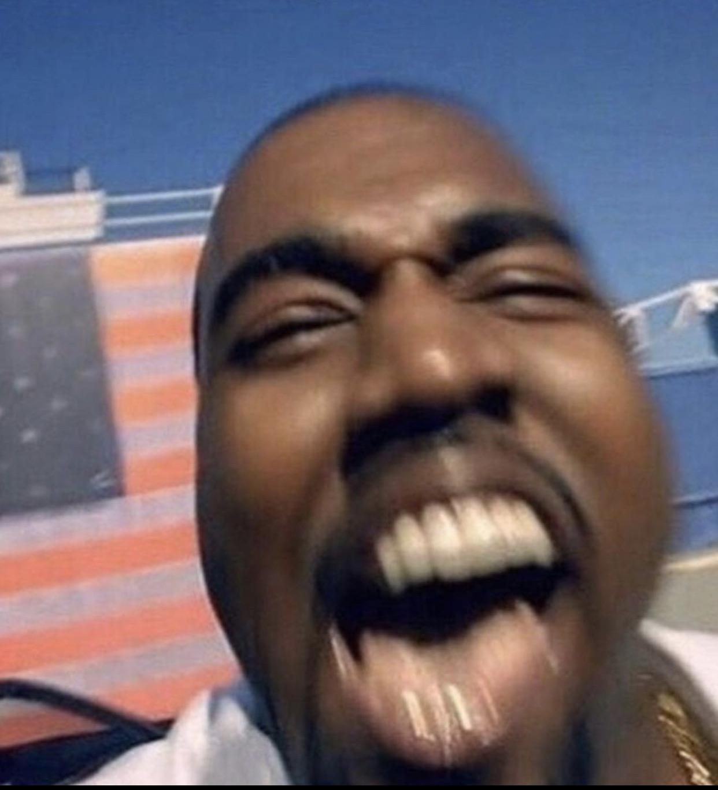

Deep learning model that predicts whether a sentence sounds like something Kanye West (Ye) would say along with the probability showing how “Ye-like” a given text is. 
Build using Pytorch, model - vanilla RNN
